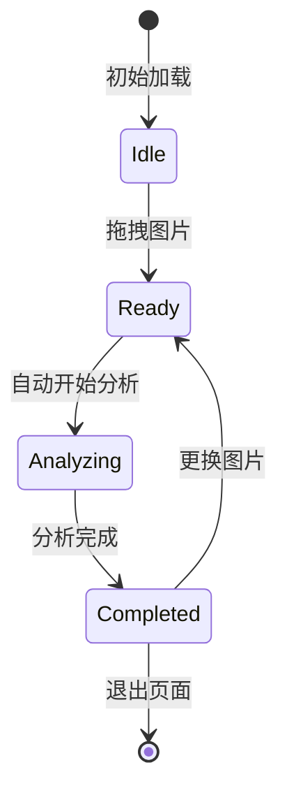

# 工作台布局设计规范

> **项目：** image_analyzer UX 设计规范
> **版本：** v1.2
> **最后更新：** 2026-02-19

---

## 概述

本文档定义 Analysis 页面的工作台式布局设计，实现统一专业视图的核心体验目标。

### 设计原则

**核心目标：**
- ✅ 统一专业视图：所有功能在一个页面内完成
- ✅ 固定信息架构：三列同时可见，无需页面跳转
- ✅ 零摩擦交互：拖拽即开始，进度实时更新
- ✅ 信息按需展开：通过折叠控制复杂度

---

## 桌面端三列布局

### 布局结构

```
┌─────────────────────────────────────────────────────────────────────┐
│                        Analysis 工作台                               │
│                   (统一专业视图 · 信息分层)                           │
└─────────────────────────────────────────────────────────────────────┘
┌──────────────┬────────────────────────┬──────────────────┐
│  左列 (25%)  │     中列 (45%)         │   右列 (30%)     │
│              │                        │                  │
│  参考图片    │     分析结果            │   可编辑模版     │
│  (固定)      │     (动态更新)          │   (动态更新)     │
│              │                        │                  │
│  ┌────────┐  │  ┌──────────────────┐  │  ┌────────────┐ │
│  │ 图片   │  │  │ 整体置信度       │  │  │ 一键复制   │ │
│  │ 预览   │  │  │ ─────────────── │  │  │ ────────── │ │
│  │        │  │  │ 风格标签         │  │  │ 模版内容   │ │
│  └────────┘  │  │ ─────────────── │  │  │            │ │
│              │  │ 四维度卡片       │  │  │ [复制按钮] │ │
│  上传区域    │  │  • 光影          │  │  └────────────┘ │
│  (可折叠)    │  │  • 构图          │  │                  │
│              │  │  • 色彩          │  │  变量替换       │
│  文件信息    │  │  • 艺术风格      │  │  (可折叠)       │
│  模型选择    │  │ ─────────────── │  │                  │
│              │  │ [展开详细分析 ▼] │  │  质量指标       │
│              │  └──────────────────┘  │  (可折叠)       │
│              │                        │                  │
│              │  分析中：进度条        │  社交证明       │
│              │  完成后：结果展示      │  (可折叠)       │
│              │                        │                  │
└──────────────┴────────────────────────┴──────────────────┘
```

### 列宽定义

| 列 | 宽度比例 | Grid 配置 | 说明 |
|----|---------|----------|------|
| 左列 | 25% | `xs={12} md={3}` | 参考图片 + 上传区 |
| 中列 | 45% | `xs={12} md={6}` | 分析结果（主要区域） |
| 右列 | 30% | `xs={12} md={3}` | 模版编辑 + 操作 |

### 响应式策略

**桌面端 (≥960px)：**
- 三列布局
- 所有列同时可见
- 水平空间充分利用

**平板端 (600px-959px)：**
- 两列布局：左列 40% + 右侧 60%（中列+右列堆叠）
- 或单列布局，垂直堆叠

**移动端 (<600px)：**
- 单列垂直布局
- 左列 → 中列 → 右列
- 固定顺序：参考图 → 结果 → 模版

---

## 左列：参考图片区

### 组件构成

```tsx
<Box className="left-column">
  {/* 图片预览区 */}
  <Card className="ia-glass-card">
    {imageData ? (
      <ImagePreview
        src={imageData.url}
        alt="参考图片"
        width={300}
        height={300}
      />
    ) : (
      <ImageUploader />
    )}
  </Card>

  {/* 文件信息（上传后显示） */}
  {imageData && (
    <FileInfo
      fileName={imageData.fileName}
      fileSize={imageData.fileSize}
      dimensions={`${imageData.width}x${imageData.height}`}
    />
  )}

  {/* 模型选择（可折叠） */}
  {imageData && (
    <CollapsibleSection
      title="分析配置"
      defaultExpanded={false}
    >
      <ModelSelector
        models={models}
        selectedModel={selectedModelId}
        onChange={setSelectedModelId}
      />
    </CollapsibleSection>
  )}
</Box>
```

### 状态变化

**状态 1：空闲 (idle)**
- 显示上传区域
- 虚线边框，拖拽高亮

**状态 2：已上传 (ready)**
- 显示图片预览
- 显示文件信息
- 显示模型选择（可折叠）

**状态 3：分析中 (analyzing)**
- 图片预览保持
- 模型选择折叠
- 显示"分析中"徽章

**状态 4：已完成 (completed)**
- 图片预览保持
- 显示"更换图片"按钮（小按钮）

---

## 中列：分析结果区

### 组件构成

```tsx
<Box className="middle-column">
  {/* 空状态 */}
  {!imageData && (
    <EmptyState
      icon={<Brain />}
      title="开始分析"
      description="上传图片后，分析结果将在此显示"
    />
  )}

  {/* 进度状态 */}
  {status === 'analyzing' && (
    <ProgressDisplay
      type="analysis"
      showStageIndicator={true}
      showTermScroller={true}
    />
  )}

  {/* 结果状态 */}
  {status === 'completed' && analysisData && (
    <Box>
      {/* 整体置信度 */}
      <OverallConfidence
        value={analysisData.overallConfidence}
      />

      {/* 风格标签 */}
      <StyleTags
        tags={analysisData.styleTags}
      />

      {/* 四维度分析（默认展开前两个） */}
      <DimensionsGrid>
        {Object.entries(analysisData.dimensions).map(([key, dim]) => (
          <DimensionCard
            key={key}
            dimensionType={key}
            dimension={dim}
            defaultExpanded={['lighting', 'composition'].includes(key)}
          />
        ))}
      </DimensionsGrid>

      {/* 详细分析（可折叠） */}
      <CollapsibleSection
        title="详细分析"
        defaultExpanded={false}
      >
        <DetailedAnalysis data={analysisData} />
      </CollapsibleSection>
    </Box>
  )}
</Box>
```

### 信息层级

**层级 1：核心信息（默认可见）**
- 整体置信度
- 风格标签
- 一键复制按钮（从右列）
- 前两个维度卡片（光影、构图）

**层级 2：增强信息（按需展开）**
- 后两个维度卡片（色彩、艺术风格）
- 详细分析

**层级 3：深度信息（二次展开）**
- 每个维度内的术语解释
- 参数来源说明

---

## 右列：可编辑模版区

### 组件构成

```tsx
<Box className="right-column">
  {/* 空状态 */}
  {!analysisData && (
    <EmptyState
      icon={<Copy />}
      title="模版编辑器"
      description="分析完成后，可在此编辑和复制模版"
    />
  )}

  {/* 模版内容 */}
  {analysisData && (
    <Box>
      {/* 一键复制（突出显示） */}
      <Card className="ia-glass-card ia-glass-card--active">
        <Box sx={{ p: 2 }}>
          <Typography variant="h6" gutterBottom>
            模版已生成 ✓
          </Typography>
          <Button
            variant="contained"
            fullWidth
            onClick={handleCopy}
            startIcon={<Copy />}
          >
            一键复制到剪贴板
          </Button>
        </Box>
      </Card>

      {/* 模版预览（可折叠） */}
      <CollapsibleSection
        title="模版内容"
        defaultExpanded={true}
      >
        <TemplatePreview
          template={analysisData.template}
          language="midjourney"
        />
      </CollapsibleSection>

      {/* 变量替换（可折叠） */}
      <CollapsibleSection
        title="变量替换"
        defaultExpanded={false}
      >
        <VariableReplacer
          template={analysisData.template}
          onPreview={handlePreview}
        />
      </CollapsibleSection>

      {/* 质量指标（可折叠） */}
      <CollapsibleSection
        title="质量指标"
        defaultExpanded={true}
      >
        <QualityBadge
          usageCount={analysisData.usageCount}
          successRate={analysisData.successRate}
          rating={analysisData.rating}
        />
      </CollapsibleSection>

      {/* 社交证明（可折叠） */}
      <CollapsibleSection
        title="使用此模版生成的图片"
        defaultExpanded={false}
      >
        <SocialProofGallery
          images={analysisData.showcaseImages}
        />
      </CollapsibleSection>

      {/* 用户反馈 */}
      <Card className="ia-glass-card" sx={{ mt: 2 }}>
        <Box sx={{ p: 2 }}>
          <Typography variant="body2" gutterBottom>
            这个分析准确吗？
          </Typography>
          <FeedbackButtons onFeedback={handleFeedback} />
        </Box>
      </Card>
    </Box>
  )}
</Box>
```

### 信息层级

**层级 1：核心操作（默认可见）**
- 一键复制按钮
- 质量指标

**层级 2：模版内容（默认展开）**
- 模版预览
- 参数完整性徽章

**层级 3：高级功能（按需展开）**
- 变量替换
- 社交证明画廊

---

## 交互流程

### 完整流程



### 关键交互点

**1. 拖拽上传（零摩擦）**
- 用户拖拽图片到左列
- 自动开始上传
- 上传完成后自动开始分析（无需点击"开始分析"）

**2. 进度反馈（实时）**
- 中列显示进度条
- 显示当前阶段："正在识别光影技巧..."
- 显示预计剩余时间

**3. 结果展示（原地展开）**
- 分析完成后，中列和右列原地更新
- 无需页面跳转
- 左列图片预览保持可见

**4. 模版复制（一键操作）**
- 右列突出显示"一键复制"按钮
- 点击后显示"已复制"提示
- 支持快捷键 Ctrl+C

---

## 组件状态管理

### 全局状态

```tsx
interface WorkspaceState {
  // 左列状态
  image: {
    data: ImageData | null;
    status: 'idle' | 'uploading' | 'ready';
  };

  // 中列状态
  analysis: {
    data: AnalysisData | null;
    status: 'idle' | 'analyzing' | 'completed' | 'error';
    progress: number;
    stage: string;
  };

  // 右列状态
  template: {
    content: string | null;
    copied: boolean;
    variables: Record<string, string>;
  };

  // 全局配置
  config: {
    selectedModel: string;
    autoStart: boolean;
  };
}
```

### 状态同步

- 左列上传完成 → 自动触发中列分析
- 中列分析完成 → 自动更新右列模版
- 右列模版更新 → 左列保持图片预览

---

## 可折叠组件规范

### CollapsibleSection 组件

```tsx
interface CollapsibleSectionProps {
  title: string;
  defaultExpanded: boolean;
  children: React.ReactNode;
  onToggle?: (expanded: boolean) => void;
}

// 使用示例
<CollapsibleSection
  title="详细分析"
  defaultExpanded={false}
  onToggle={(expanded) => {
    // 记录用户偏好
    localStorage.setItem('detail-expanded', String(expanded));
  }}
>
  <DetailedAnalysis />
</CollapsibleSection>
```

### 折叠策略

**默认展开的区块：**
- 整体置信度
- 风格标签
- 一键复制
- 质量指标
- 前两个维度卡片（光影、构图）

**默认折叠的区块：**
- 模型选择
- 后两个维度卡片（色彩、艺术风格）
- 详细分析
- 变量替换
- 社交证明画廊

**用户偏好记忆：**
- 使用 `localStorage` 记住用户的展开/折叠偏好
- 下次访问时恢复用户的选择

---

## 移动端适配

### 单列垂直布局

```
┌──────────────────┐
│   参考图片       │
│   (左列)         │
│                  │
│   上传/预览      │
└──────────────────┘
         ↓
┌──────────────────┐
│   分析结果       │
│   (中列)         │
│                  │
│   置信度         │
│   标签           │
│   四维度         │
└──────────────────┘
         ↓
┌──────────────────┐
│   可编辑模版     │
│   (右列)         │
│                  │
│   一键复制       │
│   模版内容       │
│   质量指标       │
└──────────────────┘
```

### 移动端简化

**隐藏的功能：**
- 社交证明画廊（引导到桌面端查看）
- 变量替换（引导到桌面端使用）
- 详细分析（只显示四维度摘要）

**保留的功能：**
- 上传图片
- 查看置信度
- 查看风格标签
- 一键复制模版
- 查看质量指标

**提示文案：**
- "在桌面端查看详细分析和变量替换功能"

---

## 开发实施检查清单

### 布局实施

- [ ] 创建三列响应式布局（Grid 组件）
- [ ] 实现左列：图片预览 + 上传区
- [ ] 实现中列：进度 + 结果区
- [ ] 实现右列：模版编辑 + 操作区
- [ ] 验证桌面端三列布局
- [ ] 验证移动端单列布局

### 交互实施

- [ ] 拖拽上传触发自动分析
- [ ] 进度条在中列实时更新
- [ ] 结果在中列原地展开
- [ ] 模版在右列自动生成
- [ ] 左列图片预览保持可见

### 组件开发

- [ ] CollapsibleSection 组件
- [ ] ImagePreview 组件
- [ ] EmptyState 组件
- [ ] TemplatePreview 组件
- [ ] VariableReplacer 组件

### 状态管理

- [ ] WorkspaceState 全局状态
- [ ] 列间状态同步
- [ ] 用户偏好记忆（localStorage）
- [ ] 错误处理和回退

### 测试验收

- [ ] 桌面端 Chrome/Safari/Firefox
- [ ] 移动端 iOS/Android
- [ ] 状态切换流畅性
- [ ] 折叠/展开动画
- [ ] 快捷键支持（Ctrl+C）

---

## 📚 相关文档

- [核心流程优化](./12-core-flow-optimization.md)
- [组件策略](./09-component-strategy.md)
- [UX 模式分析](./04-ux-patterns.md)
- [返回总览](./README.md)
